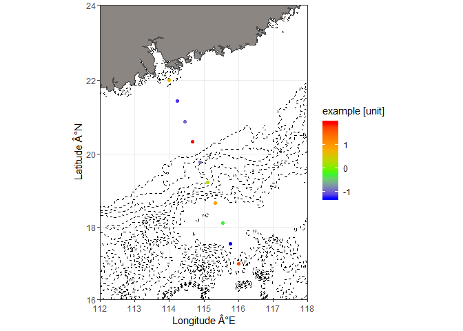
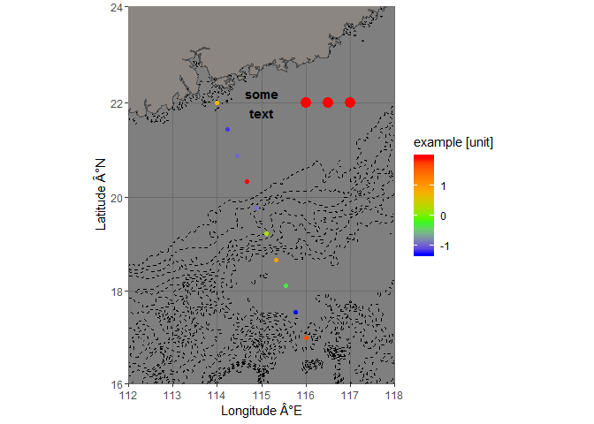
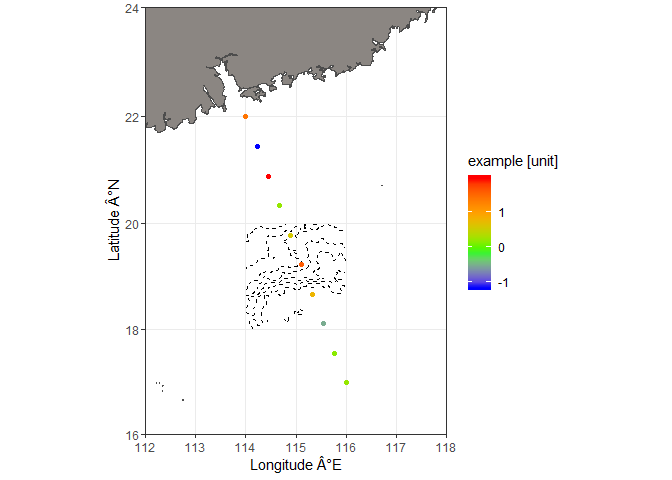

plot a surface map for ocean data
================
David Kaiser
12 February 2019

### Description

This function uses ggplot to make a surface map to visualize ocean science data. It is **not** suitable for terrestrial data because the land map is plotted above the data points. Land map data is contained in the package mapdata. Ocean bathymetry is optionally plotted and data is retrieved from NOAA with a call to marmap::getNOAA.bathy(); alternatively, bathymetry data can be supplied as an existing object of class bathy.

### Arguments

*bathymetry = TRUE* -- can be logical (i.e. should a bathymetry be plotted) or the name of an object of class bathy

*keep = TRUE* -- keep downloaded bathymetry in the current wd? only relevant with bathymetry=TRUE

*lon.min, lon.max, lat.min, lat.max* -- map limits

*lats, lons* -- latitude and longitude of data

*values* -- data values

*value.name* -- name for the data legend

### Example

normal plot

``` r
p1 <- plot_map(
    bathymetry = TRUE,
    keep = FALSE,
    lon.min = 112,
    lon.max = 118,
    lat.min = 16,
    lat.max = 24,
    lats = seq(22, 17, length.out = 10),
    lons = seq(114, 116, length.out = 10),
    values = rnorm(10),
    value.name = "example [unit]"
)
```

    ## Querying NOAA database ...
    ## This may take seconds to minutes, depending on grid size
    ## Building bathy matrix ...

``` r
p1
```



because the result is a ggplot, it can be extendend with additional layers, and the theme can be changed

``` r
p1 +
    annotate("text", x = 115, y = 22, label = "some\ntext", size = 4, fontface = "bold") +
    geom_point(aes(x = c(116, 116.5, 117), y = c(22, 22, 22)), col = "red", size = 4) +
    theme_dark()
```



plot with bathy object supplied

``` r
plot_map(
    bathymetry = marmap::getNOAA.bathy(lon1 = 114, lon2 = 116, lat1 = 18, lat2 = 20, resolution = 1),
    keep = FALSE,
    lon.min = 112,
    lon.max = 118,
    lat.min = 16,
    lat.max = 24,
    lats = seq(22, 17, length.out = 10),
    lons = seq(114, 116, length.out = 10),
    values = rnorm(10),
    value.name = "example [unit]")
```

    ## Querying NOAA database ...
    ## This may take seconds to minutes, depending on grid size
    ## Building bathy matrix ...


