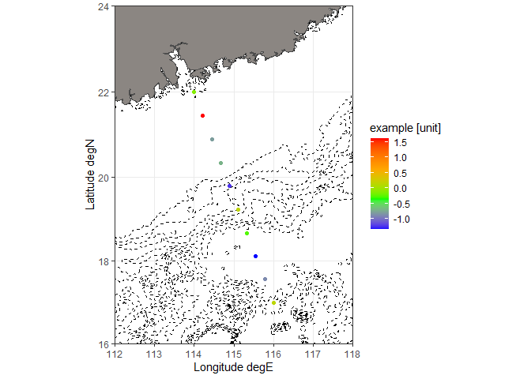
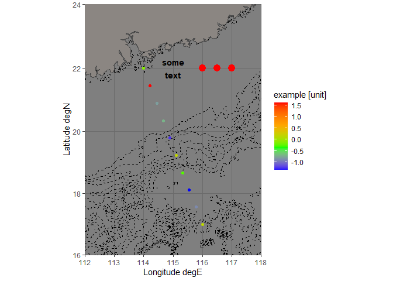
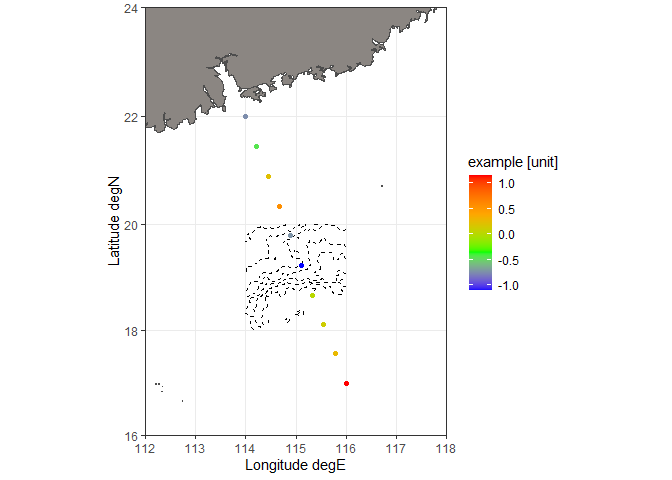
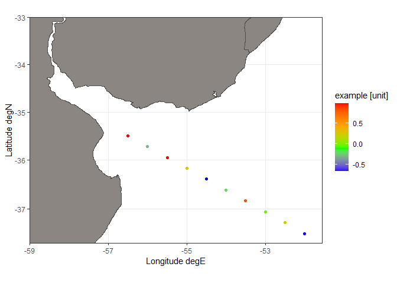
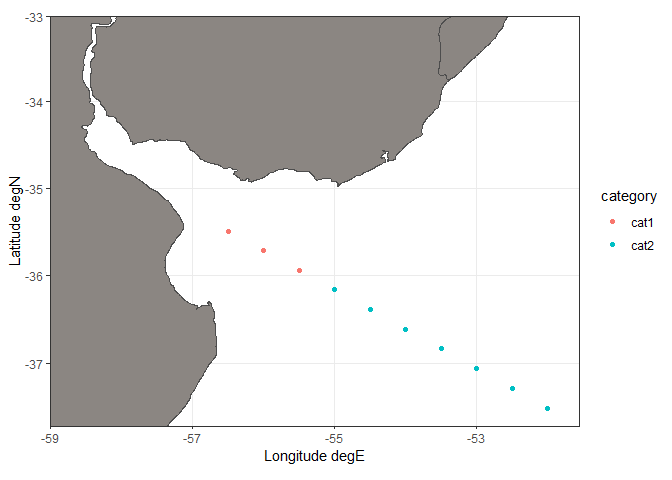
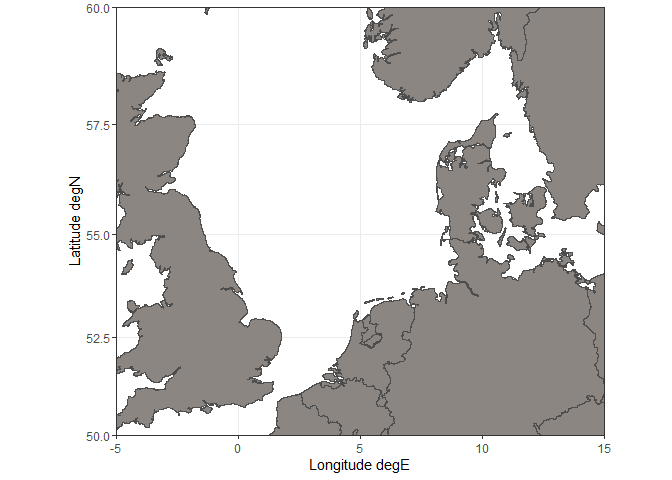
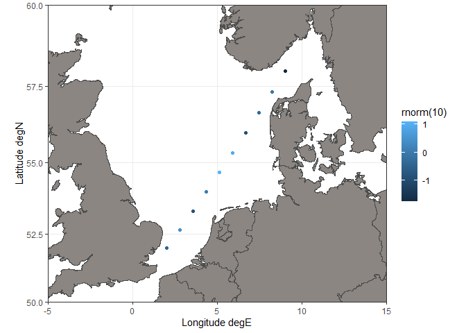

plot a surface map for ocean data
================

### Description

This function uses ggplot to make a surface map to visualize ocean
science data. It is **not** suitable for terrestrial data because the
land map is plotted above the data points. Land map data is contained in
the package mapdata. Ocean bathymetry is optionally plotted and data is
retrieved from NOAA with a call to marmap::getNOAA.bathy();
alternatively, bathymetry data can be supplied as an existing object of
class bathy.

### Arguments

*bathymetry = FALSE* – can be logical (i.e. should a bathymetry be
plotted) or the name of an object of class bathy

*keep = FALSE* – keep downloaded bathymetry in the current wd? only
relevant with bathymetry=TRUE

*lon.min, lon.max, lat.min, lat.max* – map limits, if not supplied the
range of lats and lons will be slightly extended

*lats, lons* – latitude and longitude of data

*values* – optional, data values

*value.name* – optional, name for the data legend

### Example

normal plot

``` r
p1 <- plot_map(
    bathymetry = TRUE,
    keep = FALSE,
    lon.min = 112,
    lon.max = 118,
    lat.min = 16,
    lat.max = 24,
    lats = seq(22, 17, length.out = 10),
    lons = seq(114, 116, length.out = 10),
    values = rnorm(10),
    value.name = "example [unit]"
)
```

    ## Registered S3 methods overwritten by 'adehabitatMA':
    ##   method                       from
    ##   print.SpatialPixelsDataFrame sp  
    ##   print.SpatialPixels          sp

    ## Querying NOAA database ...

    ## This may take seconds to minutes, depending on grid size

    ## Building bathy matrix ...

``` r
p1
```

<!-- -->

because the result is a ggplot, it can be extended with additional
layers, and the theme can be changed

``` r
p1 +
    annotate("text", x = 115, y = 22, label = "some\ntext", size = 4, fontface = "bold") +
    geom_point(aes(x = c(116, 116.5, 117), y = c(22, 22, 22)), col = "red", size = 4) +
    theme_dark()
```

<!-- -->

plot with bathy object supplied

``` r
plot_map(
    bathymetry = marmap::getNOAA.bathy(lon1 = 114, lon2 = 116, lat1 = 18, lat2 = 20, resolution = 1),
    keep = FALSE,
    lon.min = 112,
    lon.max = 118,
    lat.min = 16,
    lat.max = 24,
    lats = seq(22, 17, length.out = 10),
    lons = seq(114, 116, length.out = 10),
    values = rnorm(10),
    value.name = "example [unit]")
```

    ## Querying NOAA database ...

    ## This may take seconds to minutes, depending on grid size

    ## Building bathy matrix ...

<!-- -->

bounding box not fully supplied

``` r
plot_map(
    lon.min = -59, 
    lat.max = -33,
    lats = seq(-35.5, -37.5, length.out = 10),
    lons = seq(-56.5, -52, length.out = 10),
    values = rnorm(10),
    value.name = "example [unit]"
)
```

<!-- -->

plot with categorical values

``` r
plot_map(
    lon.min = -59, 
    lat.max = -33,
    lats = seq(-35.5, -37.5, length.out = 10),
    lons = seq(-56.5, -52, length.out = 10),
    values = c(rep("cat1", 3), rep("cat2", 7)),
    value.name = "category")
```

<!-- -->

the function can also be used to make an empty

``` r
p1 <- plot_map(lon.min = -5, lon.max = 15, lat.min = 50, lat.max = 60)
p1
```

<!-- -->

… which can then be filled with data

``` r
p1 + geom_point(aes(seq(2, 9, length.out = 10), seq(52, 58, length.out = 10), col = rnorm(10)))
```

<!-- -->
